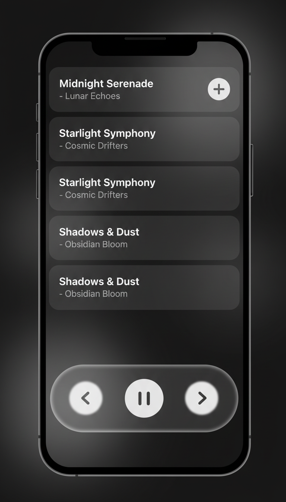
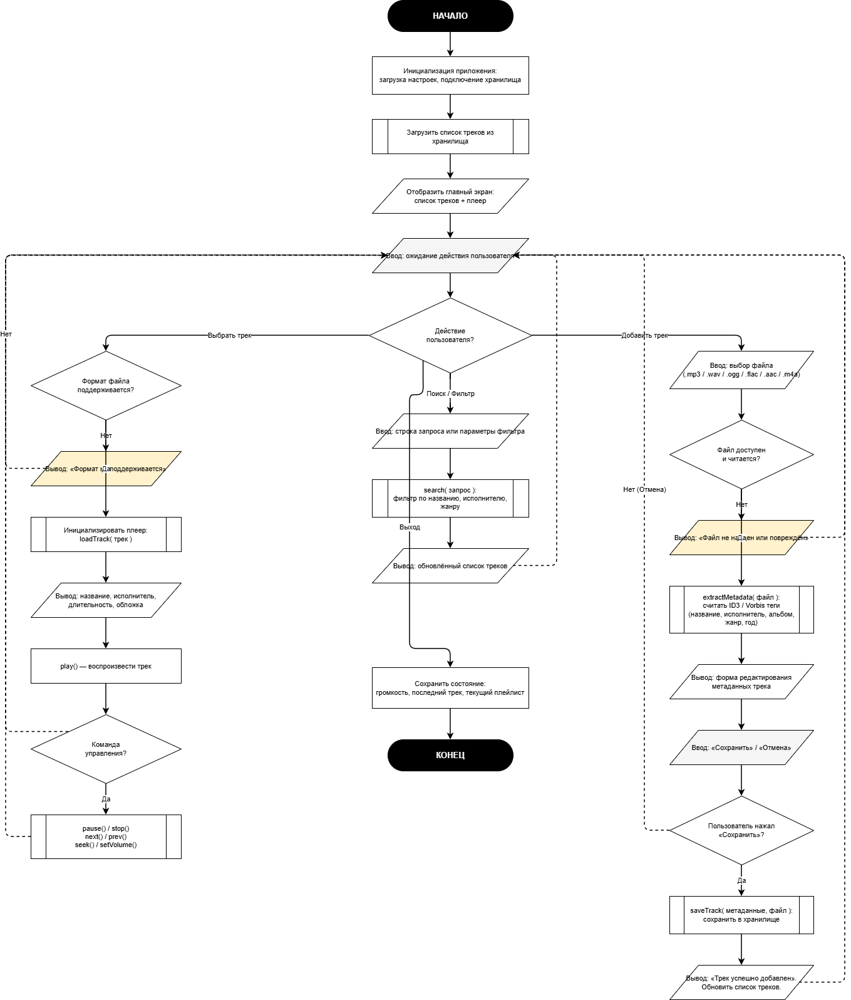

<p align="center">
  
</p>

<h1 align="center">Onyx Player</h1>

<p align="center">
  Минималистичный аудиоплеер с 5-полосным эквалайзером, написанный на Python + PyQt6
</p>

<p align="center">
  
  
  
  
</p>

---

## Возможности

- 🎵 **Воспроизведение** MP3, WAV, FLAC, OGG, M4A
- 🎚️ **5-полосный эквалайзер** — 60 Гц / 250 Гц / 1 кГц / 4 кГц / 16 кГц с biquad-фильтрами второго порядка
- 🔊 **Регулировка громкости** с визуальным ползунком
- ⏩ **Перемотка трека** — ползунок работает и во время воспроизведения, и на паузе
- 🔁 **Режим повтора** одного трека
- 🔍 **Поиск** по названию и исполнителю (регистронезависимый)
- 💾 **Автосохранение** плейлиста при закрытии
- 🎨 **Тёмный UI** в стиле iOS / Material с жестом свайп-вверх для открытия страницы трека

---


## Архитектура

```
onyx/
├── app/
│   ├── main.py          # MainWindow — оркестрирует все модули
│   ├── player_bar.py    # Нижняя панель плеера (play/prev/next, свайп)
│   ├── track_page.py    # Полноэкранная страница трека + EQ
│   ├── track_list.py    # Список карточек треков + EmptyState
│   ├── equalizer.py     # UI эквалайзера (5 ползунков + пресеты)
│   ├── eq_engine.py     # DSP-движок (biquad SOS, sounddevice поток)
│   ├── widgets.py       # Переиспользуемые виджеты (слайдер, кнопки, label)
│   ├── icons.py         # SVG иконки, встроенные в код
│   ├── conftest.py      # pytest фикстуры (изоляция от cfg)
│   └── test_onyx.py     # 87 тестов
├── Diagram.png          # UML диаграмма модулей
├── requirements.txt
└── README.md
```

### Схема модулей



---

## Установка

**Требования:** Python 3.11+, pip

```bash
# 1. Клонировать репозиторий
git clone https://github.com/yummyactually/onyx.git
cd onyx

# 2. Установить зависимости
pip install -r requirements.txt

# 3. Запустить
python app/main.py
```

> **Windows:** убедитесь, что установлен [Microsoft Visual C++ Redistributable](https://aka.ms/vs/17/release/vc_redist.x64.exe) — требуется для `sounddevice`.

---

## Запуск тестов

```bash
cd app
pytest test_onyx.py -v
```

Тесты покрывают **7 категорий**, 87 сценариев:

| Категория | Тестов | Что проверяется |
|-----------|-------:|-----------------|
| Metadata | 8 | Чтение тегов, fallback на имя файла, форматы |
| Formatting | 5 | Форматирование `ms → M:SS` |
| DSP | 9 | Biquad коэффициенты, численная стабильность |
| Engine | 12 | Громкость, gains, seek, pause/resume |
| Widgets | 12 | ThinSlider, кнопки, ElidingLabel |
| UI | 21 | PlayerBar, TrackPage, TrackCard |
| Integration | 20 | MainWindow: поиск, навигация, конфиг |
| **Итого** | **87** | |

Подробная таблица тестов: [`onyx_test_report.xlsx`](onyx_test_report.xlsx)

---

## Зависимости

| Пакет | Назначение |
|-------|------------|
| `PyQt6` | GUI фреймворк |
| `sounddevice` | Аудиопоток (PortAudio) |
| `mutagen` | Чтение ID3 / Vorbis тегов |
| `numpy` | DSP вычисления (SOS фильтры) |
| `pytest` + `pytest-qt` | Тестирование |

---

## Документация

- 📄 [Реферат по проектированию UI](Реферат_Проектирование_UI.docx)
- 📊 [Презентация](Проектирование%20UI%20-%20Музыкальный%20плеер.pptx)
- 🗺️ [UML диаграмма (draw.io)](Diagram.drawio)

---

## Лицензия

MIT © 2025 yummyactually
